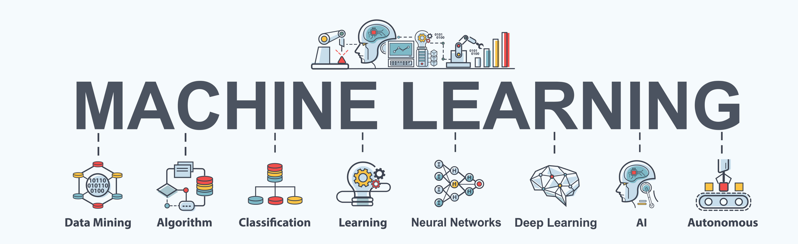

# [ Holberton School Machine Learning Projects](https://www.holbertonschool.com/tn/en/pathway_machine_learning)

## 👉 Intro

This repository contains the Machine Learning projects that we've done at Holberton School wich includes:
- The important Mathematics Algorithms needed for the ML process:
    - Linear Algebra
    - Calculus
    - Probability
- Machine Learning Algorithms:
    - Classification
    - Regularization
    - Optimization
    - Error Analysis
    - Convolutional Neural Networks
    - Deep Convolutional
    - Architectures
    - Transfer Learning
    - Object Detection
    - Face Verification
    - Neural Style Transfer
    - Recurrent Neural Networks
    - Deep Recurrent Architectures
    - Natural Language Processing
    - Time Series Analysis
    - Dimensionality Reduction
    - Clustering
    - Hidden Markov Models
    - Neural Style Transfer

