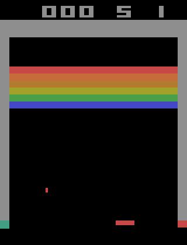

#  0x01. Deep Q-learning

<p align="center"></p>

# 🧑🏻‍💻 Intro

> Python script that utilizes keras, keras-rl, and gym to train an agent that can play Atari’s Breakout

# 📕 Dependencies

<b> ⛔️ If you have keras-rl2 already installed delete it before you start</b>.

```
pip install --user keras-rl==0.4.2
pip install --user tensorflow==1.14.0
pip install --user keras==2.2.4
pip install --user Pillow==8.0.1
pip install --user h5py==2.10.0
pip install --user atari-py==0.2.6
pip install --user gym==0.18.3
pip install --user gym[atari]

wget http://www.atarimania.com/roms/Roms.rar
unrar e -ad Roms.rar 
python -m atari_py.import_roms Roms
```

# 📝 Learning Objectives
> - What is Deep Q-learning?
> - What is the policy network?
> - What is replay memory?
> - What is the target network?
> - Why must we utilize two separate networks during training?
> - What is keras-rl? How do you use it?

# 🔗 Resources

- [Deep Q-Learning - Combining Neural Networks and Reinforcement Learning]()
- [Replay Memory Explained - Experience for Deep Q-Network Training]()
- [Training a Deep Q-Network - Reinforcement Learning]()
- [Training a Deep Q-Network with Fixed Q-targets - Reinforcement Learning]()
- [keras-rl]()
- [rl.policy]()
- [rl.memory]()
- [rl.agents.dqn]()
- [Playing Atari with Deep Reinforcement Learning]()
<hr>

By [Khouloud](https://www.linkedin.com/in/khouloud-alkhammassi-3a9078129) Software engineer at [HolbertonSchool®️](https://www.holbertonschool.com)